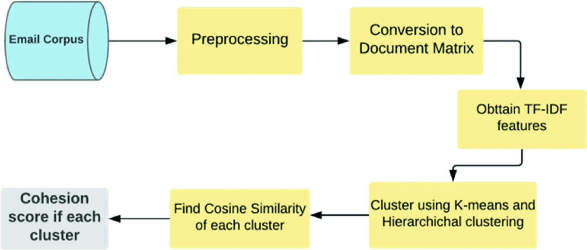
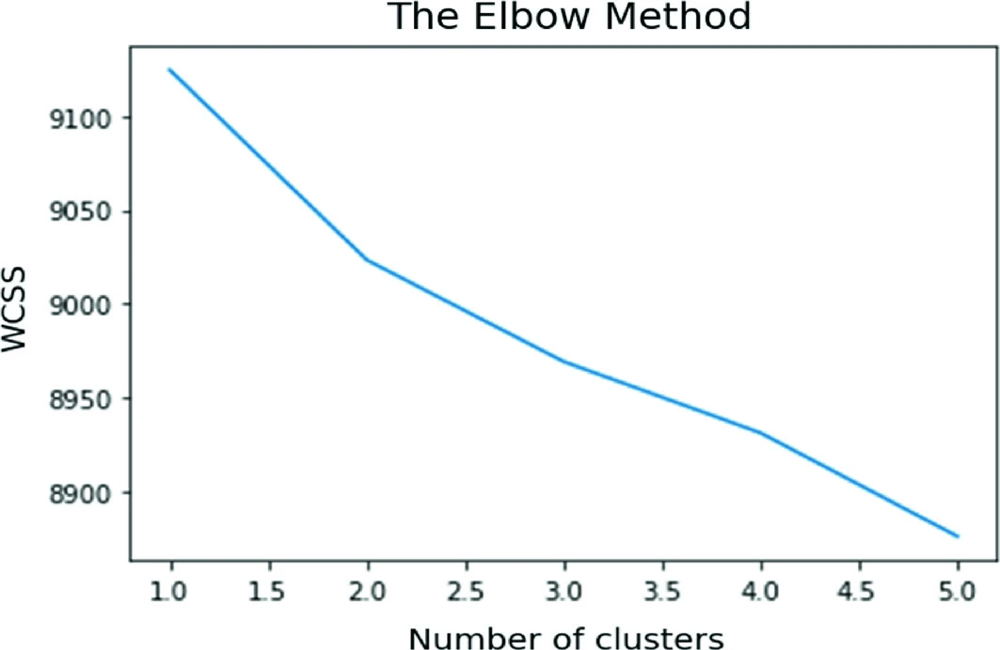
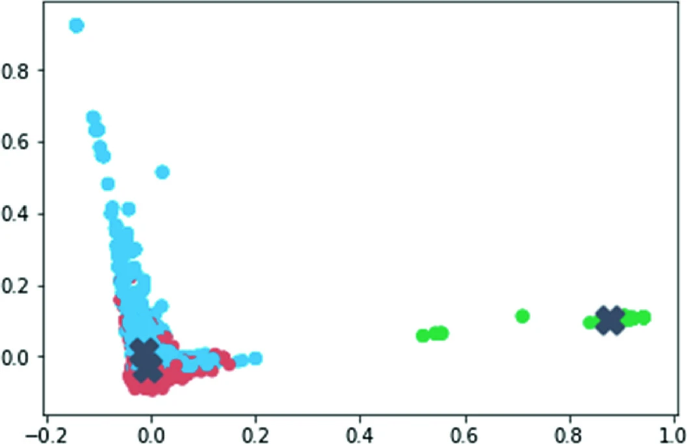

# Evaluate Intra-Cluster Cosine Similarity with Email Clustering  :metal:

This project involves clustering of emails and finding intra-cluster similarity through a cohesion score. It uses K-means and Hierarchical clustering for implementation.
My research publication as the first author : https://link.springer.com/chapter/10.1007/978-981-15-3369-3_9

I presented this paper as a first author at the IEEE International Conference (IC4S-2019) and was honoured with the BEST PAPER AWARD for the presentation. 

## Dataset :cloud:

The Enron email dataset was collected and prepared by the Cognitive Assistant that Learns and Organizes (CALO) project. It contains data from about 150 users, mostly senior management of Enron, organized into folders [18]. The corpus contains a total of about 0.5 M messages. The original data included approximately 500,000 emails generated by employees of the Enron Corporation. These emails were read as a.csv file, where the data was split into three columns, namely index, message id and raw message. 

## Requirements and usage :computer:
1. Anaconda 
2. Python 3.6  
3. nltk  
4. matplotlib  
Clone this repository and directly run the "EmailClustering.ipynb" file.

## Insights :pencil:
### Architecture

### Elbow Method for finding clusters for K-Means Clustering

### K-Means Clustering

### Hierarchical clustering

## Citation for my publication
[1] Kathuria, A., Mukhopadhyay, D., & Thakur, N. (2020). Evaluating cohesion score with email clustering. In Proceedings of First International Conference on Computing, Communications, and Cyber-Security (IC4S 2019) (pp. 107-119). Springer, Singapore.

